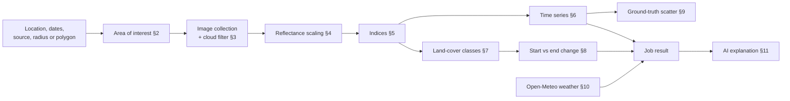

# Methodology

How Earth Insights turns satellite imagery into numbers: which scenes are used, how the indices are computed, how land cover is classified and compared, and where AI models do and do not take part. Everything here is implemented in `src/ai/flows/compute-metrics.ts` unless a section says otherwise.

[← Back to README](./README.md)

## Contents

1. [Pipeline overview](#1-pipeline-overview)
2. [Area of interest](#2-area-of-interest)
3. [Imagery sources and cloud filtering](#3-imagery-sources-and-cloud-filtering)
4. [Reflectance scaling](#4-reflectance-scaling)
5. [Spectral indices](#5-spectral-indices)
6. [Time series](#6-time-series)
7. [Land-cover classification](#7-land-cover-classification)
8. [Change detection](#8-change-detection)
9. [Ground-truth comparison](#9-ground-truth-comparison)
10. [Weather and context data](#10-weather-and-context-data)
11. [What the AI does and does not do](#11-what-the-ai-does-and-does-not-do)
12. [Reliability: retries and confidence](#12-reliability-retries-and-confidence)
13. [Assumptions and limitations](#13-assumptions-and-limitations)

---

## 1. Pipeline overview

All imagery processing runs inside Google Earth Engine. The app sends the request, waits for the job and stores the result in the `analysis_jobs` table.

## 2. Area of interest

Two ways to define the area:

- **Circle:** a point (latitude, longitude) buffered by a radius $r$, with $10 \le r \le 2000$ m (default 100 m).
- **Polygon:** a boundary drawn on the map. The area is estimated with the planar shoelace formula after projecting each vertex to metres:

$$x = \lambda \cdot 111{,}320\cos\bar\phi,\qquad y = \phi \cdot 110{,}540$$

$$A = \frac{1}{2}\left|\sum_{i} \left(x_i\,y_{i+1} - x_{i+1}\,y_i\right)\right|$$

Here $\bar\phi$ is the polygon's mean latitude. This is a cheap approximation that is fine at parcel and city scale, and it is used only to reject boundaries larger than **100 km²** before they reach Earth Engine. The polygon's centroid is the mean of its vertices, and its effective radius is half the great-circle (Haversine) distance between the south-west and north-east corners of its bounding box.

## 3. Imagery sources and cloud filtering

| Source | Earth Engine collection | Pixel size | Cloud filter |
| :--- | :--- | :---: | :--- |
| `sentinel2` | `COPERNICUS/S2_SR_HARMONIZED` | 10 m | `CLOUDY_PIXEL_PERCENTAGE` < 75 |
| `landsat` | `LANDSAT/LC09/C02/T1_L2` merged with `LANDSAT/LC08/C02/T1_L2` | 30 m | `CLOUD_COVER` < 75 |
| `modis` | `MODIS/061/MOD09GA` | 500 m | none |

Scenes are kept if they overlap the area of interest and fall within the chosen date range. The cloud threshold is a scene-level filter, not a per-pixel mask. A scene with 70% cloud cover is kept. If no scene survives, the job fails with a "no valid satellite imagery" error.

## 4. Reflectance scaling

Landsat and MODIS surface-reflectance bands are stored as scaled integers and are converted before any index is computed:

$$\rho = \text{DN}\cdot s + o$$

| Source | Scale $s$ | Offset $o$ |
| :--- | :---: | :---: |
| Landsat Collection 2 Level 2 | 0.0000275 | −0.2 |
| MODIS MOD09GA | 0.0001 | 0 |
| Sentinel-2 SR | none applied | none applied |

Because the indices are ratios, scaling matters mainly for the Landsat offset and for reflectance values shown on their own.

## 5. Spectral indices

Each index is a normalized difference of two bands, which runs from −1 to 1:

$$\text{ND}(A, B) = \frac{A - B}{A + B}$$

| Index | Formula | What it indicates |
| :--- | :--- | :--- |
| **NDVI** | $\text{ND}(\text{NIR},\ \text{Red})$ | Green vegetation vigour and density |
| **NDWI** | $\text{ND}(\text{Green},\ \text{NIR})$ | Open water (positive values) |
| **NDBI** | $\text{ND}(\text{SWIR1},\ \text{NIR})$ | Built-up and bare surfaces |
| **NBR** | $\text{ND}(\text{NIR},\ \text{SWIR2})$ | Burn severity and regrowth |

Band assignments per sensor:

| Index | Sentinel-2 | Landsat 8/9 | MODIS |
| :--- | :--- | :--- | :--- |
| NDVI | B8, B4 | SR_B5, SR_B4 | sur_refl_b02, sur_refl_b01 |
| NDWI | B3, B8 | SR_B3, SR_B5 | sur_refl_b04, sur_refl_b02 |
| NDBI | B11, B8 | SR_B6, SR_B5 | sur_refl_b06, sur_refl_b02 |
| NBR | B8A, B12 | SR_B5, SR_B7 | sur_refl_b02, sur_refl_b07 |

The raw spectral bands (B1 to B12 for Sentinel-2) are also returned as time series. A band that a sensor does not provide is left out and not filled with empty points.

Note the NDWI definition here, green against NIR, is the McFeeters form for open water. It is not the Gao NDWI that uses NIR and SWIR to measure leaf water content.

## 6. Time series

Each scene in the collection produces one data point per index and band:

- **Polygon:** the mean of the pixels inside the polygon.
- **Circle:** the value at the **centre point**, not the mean over the circle. The code notes this is cheaper and representative enough for a small area.

The mean is computed at the source's native pixel size. Points are sorted by acquisition time. A scene that returns no value for an index becomes a `null` and the chart connects over it.

## 7. Land-cover classification

Every pixel is assigned to one of four classes by fixed rules on the three indices. The rules are checked in this order, and the first match wins:

| Order | Class | Rule |
| :---: | :--- | :--- |
| 1 | Water | $\text{NDWI} > 0$ |
| 2 | Vegetation | $\text{NDVI} > 0.2$ (and not water) |
| 3 | Built-up | $\text{NDBI} > 0$ (and neither water nor vegetation) |
| 4 | Other | none of the above |

The same rules drive both the area statistics and the pixel grid shown on the map (class codes 0 other, 1 vegetation, 2 built-up, 3 water).

**Area per class** is the sum of pixel areas of that class inside the area of interest:

$$A_c = \sum_{p \in \text{AOI},\ p \in c} \text{area}(p)\ \text{[km}^2\text{]}$$

computed with Earth Engine's per-pixel area, at the source's native scale, with `bestEffort` enabled. That setting lets Earth Engine coarsen the scale if the region has too many pixels, so very large areas can be computed at a lower resolution than the table above suggests.

**Map grid.** The classification is also sampled on a coarse grid of roughly 20 by 20 cells across the area of interest (never finer than the native pixel size). This small grid is what the dashboard draws.

This is a transparent threshold classifier. It is not a trained model, and its thresholds are generic rather than tuned per region.

## 8. Change detection

The analysis compares two images: the **most recent** scene in the period and the **first** scene returned by the collection. Land-cover areas $A_c$ are computed for both.

For each class, the app reports:

$$\Delta A_c = A_c^{\text{end}} - A_c^{\text{start}},\qquad \%\Delta_c = \frac{A_c^{\text{end}} - A_c^{\text{start}}}{\left|A_c^{\text{start}}\right|}\times 100$$

Special cases follow `getPercentageChange`: if the starting area is 0, the result is 100% when the end area is positive and 0% otherwise, and the percentage is clamped to ±1,000,000.

**Change-magnitude grid.** For each cell of the same coarse grid, the app computes the mean absolute difference of the three indices between the end and start images:

$$m = \frac{|\Delta\text{NDVI}| + |\Delta\text{NDWI}| + |\Delta\text{NDBI}|}{3}$$

**Index trends** passed to the AI summary compare the first and last point of each index series. A change above +0.05 is labelled *increasing*, below −0.05 *decreasing*, and anything in between *stable*.

Only two scenes are compared, so a cloudy, hazy or off-season start or end scene can produce a change that does not reflect real land-cover shift. Choose date ranges with that in mind.

## 9. Ground-truth comparison

You can upload a CSV with `date` and `value` columns. Rows with a non-numeric value or no date are dropped.

Each ground-truth row is matched to the satellite **NDVI** series by **exact calendar date** (`yyyy-MM-dd`). Rows with no satellite observation on that exact date are excluded. The matched pairs are drawn as a scatter plot, with the ground value on the x axis and the satellite NDVI on the y axis.

No correlation, $R^2$ or regression line is computed, and matching ignores the days between satellite passes. The plot is for visual inspection. Exported CSV values that start with `=`, `+`, `-` or `@` are prefixed to prevent spreadsheet formula injection.

## 10. Weather and context data

- **Weather history:** Open-Meteo's archive API provides daily mean temperature and daily precipitation sums for the chosen period. They are shown beside the index chart.
- **Forecast and soil:** the Predict tools use Open-Meteo forecasts, plus its soil moisture and soil type data.
- **Geocoding:** place names are resolved with OpenStreetMap's Nominatim.
- **Historical baseline is simulated.** `src/ai/tools/get-historical-baseline.ts` does not query any data. It returns fixed numbers by latitude band, and a code comment says so.

| Latitude | Described as | Baseline NDVI | Baseline NDWI |
| :--- | :--- | :---: | :---: |
| below 23.5° | Tropical | 0.7 | 0.1 |
| 23.5° to 50° | Temperate | 0.5 | −0.1 |
| above 50° | Polar or subpolar | 0.2 | 0.2 |

These values are placeholders. They are passed to the AI change summary as context, so the generated text may describe a site as differing from a "baseline" that is not real. Treat any baseline comparison in the AI text as unreliable.

## 11. What the AI does and does not do

**It does not compute any satellite numbers.** Indices, areas, changes and the classification all come from the Earth Engine pipeline above.

**It does write text** about those numbers: the change summary, the report summary and the chat replies. Crop suggestions, irrigation advice, soil-moisture and yield estimates and drought and flood risk are AI-generated from weather, soil and location inputs. They are **estimates for decision support, not measurements**, and they are not validated against ground data by this project.

Inputs are sanitized before they reach a model, outputs are validated against Zod schemas, and any "confidence" field in an AI output is rescaled to the 0 to 1 range. These are formatting guarantees and not accuracy guarantees.

## 12. Reliability: retries and confidence

- **Earth Engine retries:** each evaluation is retried up to 3 times with growing delays of 1.5 s, 3 s and 4.5 s. The heavy computations run as separate evaluations, so one timeout does not discard the others.
- **Classification confidence** shown with the map is the cloud-free fraction of the scenes:

$$\text{confidence} = \mathrm{clamp}\!\left(1 - \frac{\overline{\text{cloud}\%}}{100},\ 0,\ 1\right)$$

  where the cloud value is the mean scene-level cloud percentage over the collection. It measures **input quality**, not classifier accuracy. For MODIS, which has no cloud property here, the mean defaults to 100% and the confidence shows 0.
- **Job concurrency:** by default 2 Earth Engine jobs run at once per server instance (`JOB_QUEUE_CONCURRENCY`).

## 13. Assumptions and limitations

- **Generic thresholds.** NDVI > 0.2, NDWI > 0 and NDBI > 0 are common rules of thumb. They misclassify some surfaces, for example shadows or wet soil as water, dry crops as built-up, and bare rock as built-up.
- **Two-scene change.** Change compares only the first and last scene. It is not a trend fit and it is sensitive to cloud, haze and season.
- **Scene-level cloud filter.** A scene can pass the filter and still have clouds over your area of interest.
- **Centre-point time series for circles.** A single pixel can be unrepresentative of a larger radius.
- **Resolution varies a lot.** MODIS at 500 m is unsuitable for field-scale questions. Sentinel-2 at 10 m is the best default.
- **`bestEffort` coarsening.** Large areas may be computed at a coarser scale than the native pixel size.
- **The baseline is simulated** (§10). Do not rely on it.
- **AI outputs are estimates.** Crop, soil-moisture, yield and risk figures are generated from limited inputs and are not calibrated for any particular field.
- **No uncertainty estimates.** The app reports point values with no confidence intervals.
- **Not a scientific or regulatory product.** Validate results against ground observations before using them for decisions that matter.
