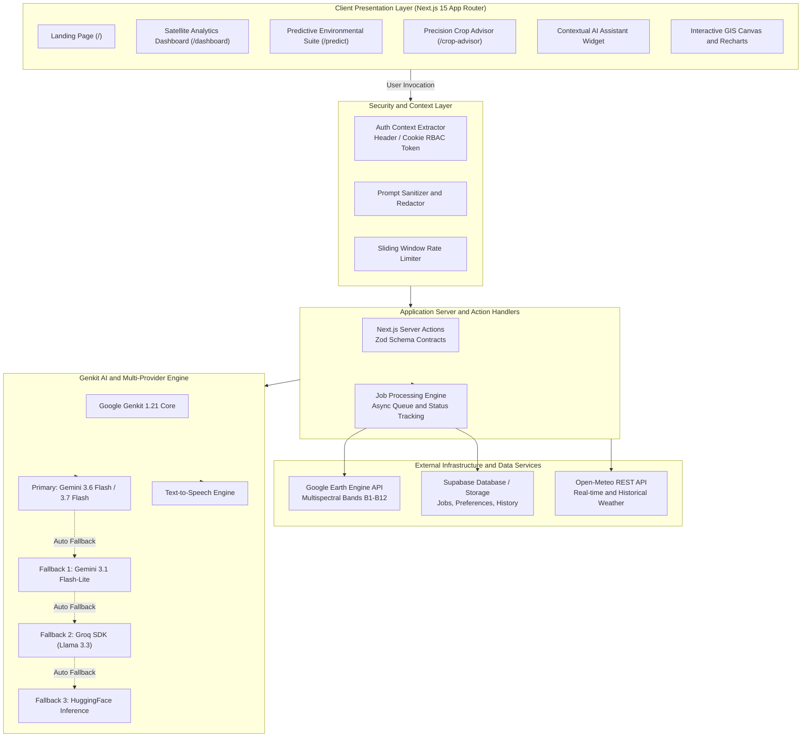
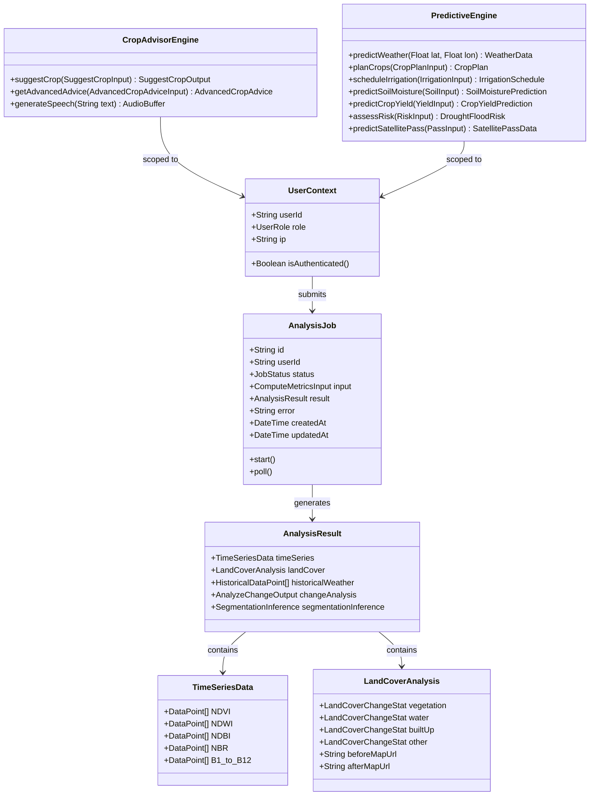
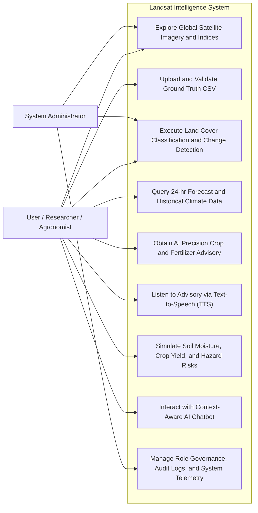
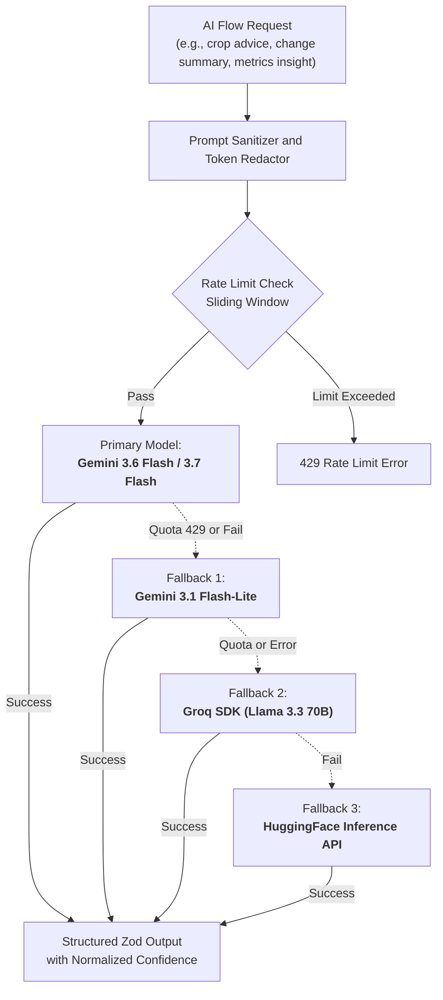
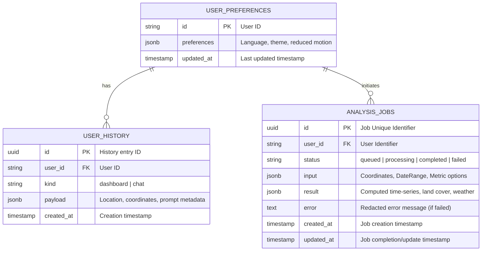

<div align="center">

# Landsat (Earth Insights)

### Satellite Data Analytics, Environmental Intelligence, and Precision Agriculture Platform


Landsat is an enterprise-grade environmental intelligence and precision agriculture platform. It bridges the gap between raw multispectral satellite imagery and ground-level decision-making by integrating Google Earth Engine, Google Genkit with Gemini models, Open-Meteo Climate APIs, and interactive GIS visualization dashboards.

---

[System Architecture](#1-system-architecture) · [UML Diagrams](#2-uml-class-and-use-case-diagrams) · [Tech Stack](#3-tech-stack) · [Features](#4-features) · [RBAC](#5-role-based-access-control-rbac) · [AI & Neural Engine](#6-ai-and-neural-engine) · [Database Schema](#7-database-schema-erd) · [API Reference](#8-api-reference) · [Security & Compliance](#9-security-and-compliance) · [Design System](#10-design-system) · [Project Structure](#11-project-structure) · [Getting Started](#12-getting-started)

</div>

---

## Table of Contents

1. [System Architecture](#1-system-architecture)
2. [UML Class and Use Case Diagrams](#2-uml-class-and-use-case-diagrams)
3. [Tech Stack](#3-tech-stack)
4. [Features](#4-features)
5. [Role-Based Access Control (RBAC)](#5-role-based-access-control-rbac)
6. [AI and Neural Engine](#6-ai-and-neural-engine)
7. [Database Schema (ERD)](#7-database-schema-erd)
8. [API Reference](#8-api-reference)
9. [Security and Compliance](#9-security-and-compliance)
10. [Design System](#10-design-system)
11. [Project Structure](#11-project-structure)
12. [Getting Started and Operational Scripts](#12-getting-started)

---

## 1. System Architecture

Landsat is architected as a distributed, service-oriented system built on Next.js 15 App Router, React Server Actions, Google Genkit AI Engine, and an asynchronous task queue for planetary-scale Earth Engine computation.



---

## 2. UML Class and Use Case Diagrams

### UML Class Diagram (Domain Models and Workflows)



### UML Use Case Diagram



---

## 3. Tech Stack

| Layer | Technology | Version | Description and Role |
| :--- | :--- | :--- | :--- |
| **Framework** | Next.js | `15.5.12` | Full-stack application framework with App Router, Turbopack, and Server Actions |
| **User Interface** | React / React DOM | `18.3.1` | Concurrent component rendering for client and server contexts |
| **Language** | TypeScript | `^5.0.0` | End-to-end static type enforcement |
| **Styling** | Tailwind CSS | `3.4.1` | Design system implementation with utility classes and animations |
| **UI Primitives** | Radix UI | Latest | Accessible, unstyled UI primitives (Dialog, Select, Accordion, Tabs) |
| **Data Visualization** | Recharts | `^2.15.1` | Declarative SVG time-series charts, scatter plots, and correlation visuals |
| **AI Orchestration** | Google Genkit | `1.21.0` | Production framework for generative flows, tools, and schema enforcement |
| **Primary LLMs** | Google Gemini | `3.6 / 3.7 Flash` | High-throughput multimodal reasoning, analytics, and agronomic generation |
| **Fallback LLMs** | Groq SDK / HuggingFace | `^0.37.0` | Automated multi-provider failover pipeline |
| **Earth Observation** | `@google/earthengine`| `^0.1.411` | Cloud-scale planetary satellite processing and spectral band extraction |
| **Meteorological Data** | Open-Meteo REST API | Latest | High-resolution global forecast and historical climate ingestion |
| **Persistence** | Supabase JS | `^2.110.6` | PostgreSQL cloud backend for asynchronous jobs, history, and preferences |
| **Schema Validation** | Zod | `^3.24.2` | Runtime schema validation for Server Actions and AI structured outputs |
| **Quality Assurance** | Vitest and Playwright | `^4.0 / ^1.55` | Unit testing, contract validation, and end-to-end browser testing |

---

## 4. Features

### 1. Multispectral Satellite Analytics (`/dashboard`)
- **Global Coordinate Exploration**: Arbitrary geographic coordinate input (Latitude, Longitude) and custom temporal observation windows.
- **Automated Spectral Indices**:
  - **NDVI** (Normalized Difference Vegetation Index): Evaluates canopy greenness, biomass density, and photosynthetic activity.
  - **NDWI** (Normalized Difference Water Index): Delineates surface water boundaries and plant water content.
  - **NDBI** (Normalized Difference Built-up Index): Accurately highlights urban density and artificial surfaces.
  - **NBR** (Normalized Burn Ratio): Evaluates burn severity and ecological regeneration.
- **Multispectral Raw Band Ingestion**: Visualizes individual spectral channels (B1 through B12) over time.
- **Asynchronous Task Processing**: Earth Engine workloads are queued and polled to maintain zero UI blocking.

### 2. Ground Truth Cross-Validation
- Upload in-situ field measurement CSV datasets (`date, value`).
- Automated temporal synchronization with satellite overpass timelines.
- Interactive scatter plot generation with linear regression line and coefficient of determination ($R^2$) calculation.
- One-click CSV export of computed time-series metrics.

### 3. Land Cover Classification and Change Analysis
- Surface area computation across four primary classes: **Vegetation**, **Water Bodies**, **Built-Up Areas**, and **Other Surfaces**.
- Absolute surface area shift ($km^2$) and percentage delta quantification over user-defined time periods.
- Dual-pane Before and After map comparison.
- Automated AI Change Insight summaries explaining environmental drivers.

### 4. Predictive Environmental Suite (`/predict`)
- **Natural Language Geocoding**: Resolves location queries (e.g., "Nile River Delta") into precise spatial coordinates (`suggestCoordinates`).
- **Weather and Climate Integration**: 24-hour hourly forecast and multi-year climate benchmarks via Open-Meteo.
- **Crop Planning**: Location-specific crop selection with optimal planting windows (`planCrops`).
- **Irrigation Scheduling**: Soil moisture estimation with calculated watering depths in inches (`scheduleIrrigation`).
- **Soil Moisture Predictions**: Volumetric water content ($m^3/m^3$) estimation with confidence scoring (`predictSoilMoisture`).
- **Crop Yield Forecasting**: Machine-assisted quantitative yield projections (`predictCropYield`).
- **Hazard Risk Assessment**: Drought and flood risk classification (`analyzeDroughtAndFloodRisk`).
- **Satellite Pass Tracking**: Orbital pass schedule prediction for Landsat and Sentinel constellations.

### 5. Precision Crop Advisor (`/crop-advisor`)
- AI-tailored crop recommendations evaluating soil taxonomy, moisture conditions, and agro-climatic zones.
- Comprehensive agronomic strategy:
  - Recommended planting density (seeds/hectare).
  - Pathogen and pest threat mitigation profiles.
  - Phased nutritional and fertilization schedules.
- **Text-to-Speech (TTS)**: Built-in audio playback for hands-free advisory access in field environments.

### 6. Context-Aware AI Assistant
- Embedded floating assistant grounded in agricultural intelligence and satellite data analysis.
- Multi-turn conversation capability with security prompt governance and sensitive data redaction.

### 7. Multilingual Support (i18n)
- Multilingual interface supporting localized language catalogs (English, Hindi, Spanish, French, and additional locales) with persistent user preference storage.

---

## 5. Role-Based Access Control (RBAC)

The platform enforces a zero-trust RBAC model via Next.js request headers and signed session cookies (`src/lib/auth.ts`).

### Roles and Permissions Matrix

| Permission / Action | Viewer (`viewer`) | Analyst (`analyst`) | Admin (`admin`) |
| :--- | :---: | :---: | :---: |
| View Public Dashboards and Visualizations | Yes | Yes | Yes |
| Run Basic Predictor Flows (Weather, Satellite Pass) | Yes | Yes | Yes |
| Execute Heavy Satellite Computations (GEE) | No | Yes | Yes |
| Upload Custom Ground Truth CSVs | No | Yes | Yes |
| Run Advanced Crop Advisory and Yield Simulations | No | Yes | Yes |
| Trigger Scenario Analysis and Hazard Risk Models | No | Yes | Yes |
| Access Admin Logs and System Telemetry | No | No | Yes |
| Modify Rate Limits and Security Policies | No | No | Yes |

### RBAC Enforcement Pattern

```typescript
// Extracted on every Server Action invocation
const authContext = await getAuthContext();
requireRole(authContext, ['analyst', 'admin']);
```

---

## 6. AI and Neural Engine

The platform AI layer is managed by Google Genkit with multi-provider redundancy to ensure zero downtime.

### Model Architecture and Resiliency Pipeline



### Core Genkit AI Flows and Tools

- `ai/flows/compute-metrics.ts`: Remote sensing calculation and AI change interpretation.
- `ai/flows/analyze-change.ts`: Natural language synthesis of multi-temporal satellite differences.
- `ai/flows/get-advanced-crop-advice.ts`: Agronomic management, risk assessment, and fertilization plans.
- `ai/flows/suggest-crop.ts`: Automated crop recommendation evaluating climate, soil, and moisture.
- `ai/flows/predict-crop-yield.ts`: Yield estimation based on historic and spectral inputs.
- `ai/flows/predict-soil-moisture.ts`: Volumetric water content regression modeling.
- `ai/flows/analyze-drought-flood-risk.ts`: Multi-spectral hazard risk classification.
- `ai/flows/chatbot.ts`: Conversational interface with memory and agricultural grounding.
- `ai/flows/text-to-speech.ts`: Multi-lingual speech synthesis.
- `ai/tools/get-soil-type.ts`, `get-soil-moisture.ts`, `get-historical-baseline.ts`: Genkit tool integrations.

---

## 7. Database Schema (ERD)

The persistent database layer utilizes PostgreSQL via Supabase, with an in-memory fallback for local development.



---

## 8. API Reference

The backend exposes strongly typed Next.js Server Actions with strict Zod validation (`src/lib/action-schemas.ts`).

### Key Action Endpoints

| Action Function | Input Schema | Output Type | Description |
| :--- | :--- | :--- | :--- |
| `startMetricsComputationAction` | `ComputeMetricsInputActionSchema` | `StartComputationOutput` | Enqueues an Earth Engine satellite analysis job |
| `getMetricsResultAction` | `{ jobId: string }` | `JobResultOutput` | Polls the status/result of an analysis job |
| `suggestCropAction` | `SuggestCropActionSchema` | `SuggestCropOutput` | Recommends crops based on coordinates and soil data |
| `getAdvancedCropAdviceAction` | `AdvancedCropAdviceActionSchema` | `AdvancedCropAdvice` | Returns detailed agronomic strategy and risk guide |
| `predictSoilMoistureAction` | `CoordinatesSchema` | `SoilMoisturePrediction` | Computes volumetric soil water content |
| `predictCropYieldAction` | `PredictCropYieldActionSchema` | `CropYieldPrediction` | Generates crop yield forecasts |
| `analyzeDroughtAndFloodRiskAction` | `CoordinatesSchema` | `DroughtFloodRisk` | Assesses drought and flood hazard risks |
| `getWeatherReportAction` | `CoordinatesSchema` | `WeatherData` | Retrieves 24-hr forecast and current conditions |
| `suggestCoordinatesAction` | `SuggestCoordinatesActionSchema` | `Coordinates` | Resolves natural language location queries |
| `chatbotAction` | `ChatbotInputActionSchema` | `ChatbotOutput` | Submits conversational turns to the AI assistant |
| `textToSpeechAction` | `TextToSpeechActionSchema` | `{ audioDataUri: string }` | Synthesizes spoken audio from text |

---

## 9. Security and Compliance

The platform implements layered security best practices to protect data integrity, prevent prompt injection, and avoid leaking credentials:

1. **Prompt Sanitization (`src/lib/security.ts`)**:
   - Strips system delimiter tags (`<|...|>`, `[INST]`, `<system>`, `<user>`).
   - Filters common jailbreak attempts ("ignore previous instructions", "developer mode").
   - Enforces strict character and token limits.
2. **Data Redaction**:
   - Automatically sanitizes API keys, Bearer tokens, secrets, and authorization headers from error messages and logs.
3. **Sliding Window Rate Limiter (`src/ai/rate-limiter.ts`)**:
   - Tracks requests per IP and user ID, rejecting bursts exceeding configured quotas.
4. **Zod Runtime Type Safety**:
   - All server actions strictly reject malformed JSON, invalid coordinates (latitude not in $[-90, 90]$, longitude not in $[-180, 180]$), and improperly formatted date strings.
5. **Zero-Trust Role Enforcement**:
   - Every sensitive server action verifies caller permissions prior to execution.

---

## 10. Design System

The application features an accessible, high-contrast design system optimized for scientific data and GIS visualization.

### Design Tokens and Visual Standards

- **Theme Support**: Dark and Light themes with `next-themes` and localStorage persistence.
- **Color Palette**:
  - **Primary**: Deep Satellite Teal / Emerald (`hsl(160, 84%, 39%)`) — represents vegetation and environmental monitoring.
  - **Secondary / Accent**: Electric Indigo (`hsl(217, 91%, 60%)`) — predictive AI and neural processing.
  - **Surfaces**: Dark slate palettes with glassmorphism backdrops (`rgba(15, 23, 42, 0.75)`).
- **Typography**: Inter / Sans-serif typography optimized for tabular numerical data and geospatial coordinates.
- **Component Primitives**: Radix UI primitives styled with Tailwind CSS, supporting full keyboard navigation and screen-reader accessibility.

---

## 11. Project Structure

```
Landsat-main/
├── .env.example                # Environment variables template
├── package.json                # Project dependencies and operational scripts
├── tsconfig.json               # TypeScript configuration
├── tailwind.config.ts          # Tailwind styling configuration
├── next.config.ts              # Next.js configuration
├── vitest.config.ts            # Vitest unit test configuration
├── playwright.config.ts        # Playwright E2E configuration
├── e2e/                        # End-to-End test suites
└── src/
    ├── ai/                     # Genkit flows, tools, and AI providers
    │   ├── flows/              # Workflows (compute-metrics, crop advice, chatbot, etc.)
    │   ├── tools/              # Tools (soil data, historical baselines, scenarios)
    │   ├── genkit.ts           # Genkit initialization and model configuration
    │   ├── providers.ts        # Multi-provider fallback manager (Gemini, Groq, HF)
    │   ├── rate-limiter.ts     # In-memory sliding window rate limiter
    │   └── prompt-governance.ts# Safety, sanitization, and prompt governance
    ├── app/                    # Next.js App Router pages
    │   ├── page.tsx            # Landing page
    │   ├── dashboard/          # Satellite analysis dashboard
    │   ├── predict/            # Predictive environmental & agriculture suite
    │   ├── crop-advisor/       # AI precision crop advisor
    │   ├── pricing/            # Subscription & pricing tiers
    │   ├── payment/            # Checkout & payment flow
    │   ├── settings/           # User configuration & preferences
    │   ├── layout.tsx          # Root layout and theme providers
    │   └── globals.css         # Global CSS design system
    ├── components/             # Reusable UI and feature components
    │   ├── ui/                 # Radix UI primitive wrappers
    │   ├── dashboard.tsx       # Main dashboard controller
    │   ├── input-panel.tsx     # Coordinate, date, and CSV input controller
    │   ├── visualizations.tsx  # Time-series charts & scatter plots
    │   ├── land-cover-analysis.tsx # Surface classification component
    │   ├── gis-dashboard.tsx   # GIS map & layer controls
    │   └── chatbot.tsx         # Floating AI conversational assistant
    ├── hooks/                  # Custom React hooks (useLanguage, useToast, etc.)
    ├── lib/                    # Server actions, security, schemas, and utilities
    │   ├── actions.ts          # Next.js Server Actions entrypoint
    │   ├── action-schemas.ts   # Zod validation schemas for all actions
    │   ├── job-queue.ts        # Async task queue for Earth Engine jobs
    │   ├── supabase.ts         # Supabase client connection
    │   ├── types.ts            # Core TypeScript types & data models
    │   └── logger.ts           # Structured logging utility
    ├── locales/                # Internationalization translation dictionaries (en, hi, es, etc.)
    ├── services/               # External service adapters (Open-Meteo, etc.)
    └── test/                   # Vitest unit and action contract tests
```

---

## 12. Getting Started

### Prerequisites

- **Node.js**: `>= 20.0.0` (Recommended: `v24.11.1`)
- **npm** or **pnpm**
- **Google Gemini API Key**: [Obtain from Google AI Studio](https://aistudio.google.com/)
- *(Optional)* **Google Earth Engine Service Account Key** for live planetary imagery analysis.

### Quick Start

```bash
# 1. Clone repository
git clone https://github.com/ArrinPaul/Satellite_Data.git
cd Satellite_Data

# 2. Install dependencies
npm install

# 3. Configure environment
cp .env.example .env.local

# 4. Start Next.js development server
npm run dev
```

Open [http://localhost:9003](http://localhost:9003) to explore the application.

### Available Scripts

| Command | Description |
| :--- | :--- |
| `npm run dev` | Starts the Next.js development server on port 9003 with Turbopack |
| `npm run genkit:dev` | Launches the interactive Google Genkit Developer UI |
| `npm run build` | Compiles the production build |
| `npm run start` | Runs the compiled production application |
| `npm run typecheck` | Executes TypeScript type checking (`tsc --noEmit`) |
| `npm run lint` | Runs ESLint validation |
| `npm run test` | Runs all Vitest unit and contract tests |
| `npm run test:contracts` | Validates Server Action schemas against contract tests |
| `npm run test:e2e` | Executes Playwright end-to-end browser tests |
| `npm run security:audit` | Runs automated npm dependency security audit |

---

## License

This project is licensed under the **MIT License**.
