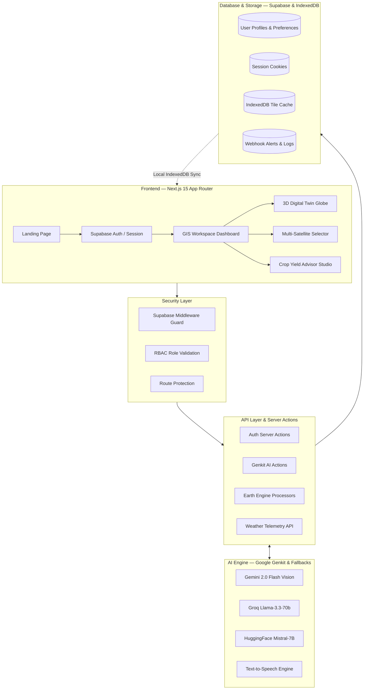
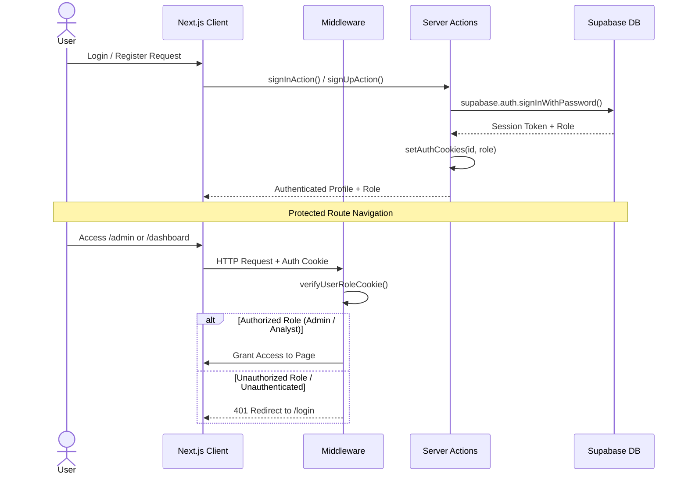
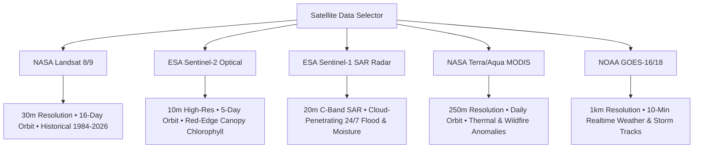
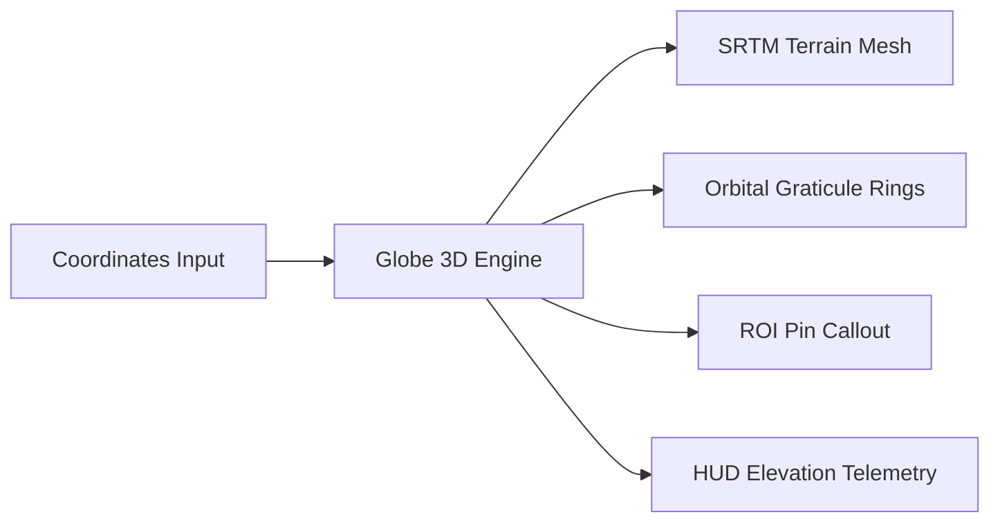
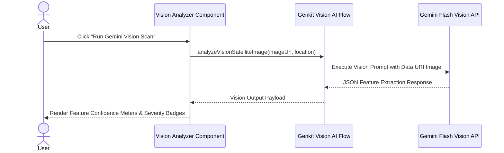
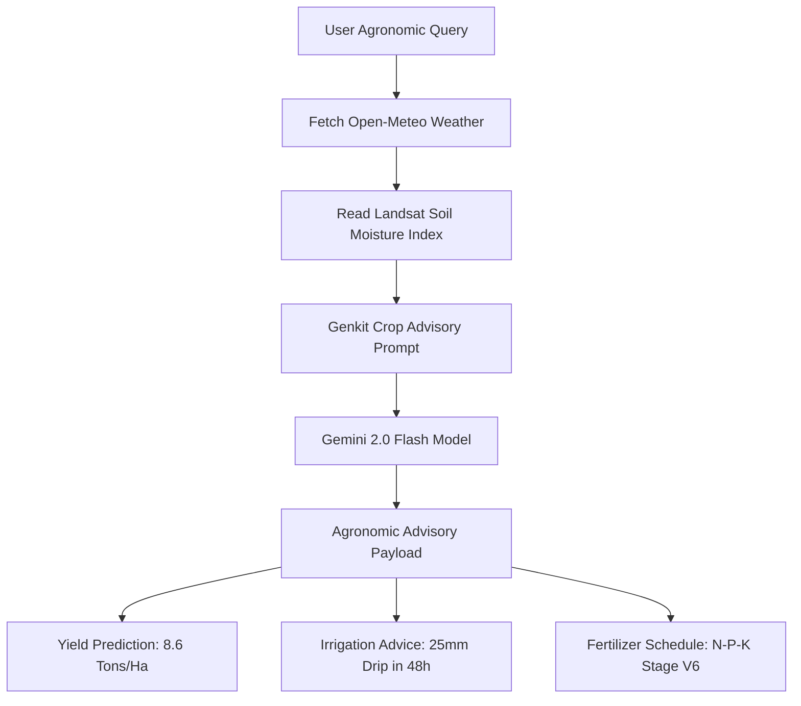
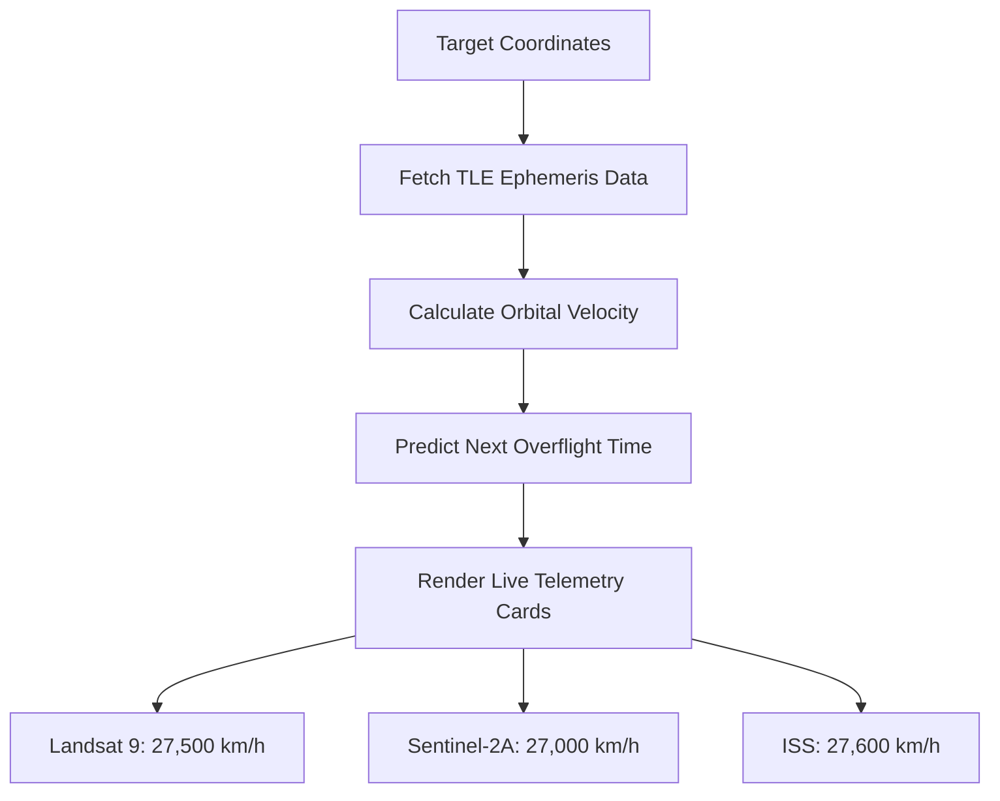
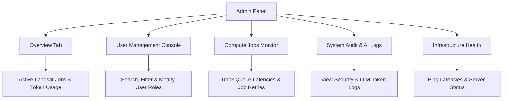
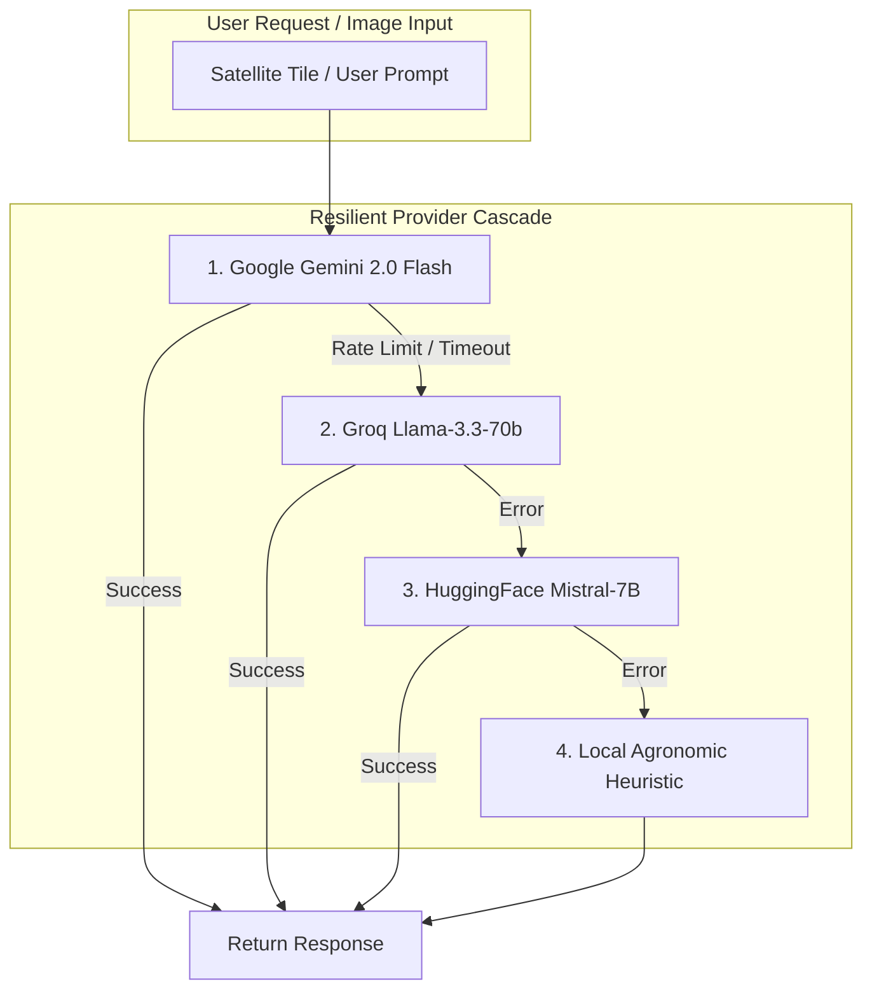

<div align="center">

# Earth Insights — Planetary Satellite Analytics Protocol

### Production-Grade Earth Observation, Multi-Spectral Analysis & AI Environmental Intelligence


Earth Insights is an industry-grade planetary observation platform designed to process multi-spectral satellite imagery from **NASA Landsat 8/9**, **ESA Sentinel-1/2**, **NASA MODIS**, and **NOAA GOES**. By fusing orbital telemetry with **Open-Meteo** meteorology, multi-modal **Gemini Flash Vision AI**, and automated **Crop Yield Advisory Agents**, it delivers real-time land cover intelligence, time-series anomaly detection, and decision support for agriculture, hydrology, urban planning, and emergency recovery.

---

[System Architecture](#system-architecture) | [Tech Stack](#tech-stack) | [Getting Started](#getting-started) | [Features](#features) | [Role-Based Access Control](#role-based-access-control) | [AI Engine](#ai--multi-modal-engine) | [API Reference](#api-reference) | [Security](#security)

</div>

---

## Table of Contents

1. [System Architecture](#system-architecture)
2. [Tech Stack](#tech-stack)
3. [Getting Started](#getting-started)
4. [Features](#features)
5. [Role-Based Access Control](#role-based-access-control)
6. [AI & Multi-Modal Engine](#ai--multi-modal-engine)
7. [API Reference](#api-reference)
8. [Security](#security)
9. [Project Structure](#project-structure)

---

## System Architecture

Earth Insights operates as a high-throughput geospatial analytics pipeline connecting space agency tile servers, multi-provider LLM fallbacks, and real-time client UI state.

### High-Level Architecture



### Authentication & Authorization Flow



---

## Tech Stack

| Layer | Technology | Purpose |
|-------|-----------|---------|
| **Frontend** | Next.js 15 (App Router) | Server-side rendering, Server Actions, App Router architecture |
| **UI Framework** | React 18 | Component architecture, state hooks, context providers |
| **Styling** | Tailwind CSS 3.4 | Custom design tokens, dark/light theme variables |
| **UI Components** | Radix UI Primitives | Accessible dropdowns, modals, tabs, sliders, popovers |
| **Satellite Engine** | Google Earth Engine (`@google/earthengine`) | Petabyte multispectral Landsat & Sentinel tile computation |
| **AI Framework** | Google Genkit + `@genkit-ai/google-genai` | Multi-modal Gemini Flash Vision, crop advice, multi-provider fallbacks |
| **Fallback LLMs** | Groq SDK & HuggingFace Inference API | High-speed zero-cost LLM fallback pipeline |
| **Authentication** | Supabase Auth (`@supabase/supabase-js`) | Session tokens, HTTP-only cookies, role management |
| **Testing** | Vitest 4 | Unit testing, AI flow contract verification |
| **Offline Cache** | Browser IndexedDB | Local raster map tile caching for field operations |

---

## Getting Started

### Prerequisites

- Node.js `24.11.1+` (or Node.js 18/20+)
- npm or yarn
- Google Earth Engine Service Account JSON
- Google Gemini API Key

### Installation

```bash
# Clone the repository
git clone https://github.com/ArrinPaul/nasa-landsat.git
cd nasa-landsat

# Install dependencies cleanly
npm install

# Set up environment variables
cp .env.example .env
# Edit .env with your actual API credentials

# Start Next.js development server
npm run dev
```

### Environment Variables

```env
# Runtime Environment
NODE_ENV=development

# Primary AI Provider (Free at https://aistudio.google.com/)
GEMINI_API_KEY=your_gemini_api_key
GOOGLE_GENAI_API_KEY=your_gemini_api_key

# Fallback AI Providers (Optional)
GROQ_API_KEY=your_groq_api_key
HUGGINGFACE_API_KEY=your_huggingface_api_key

# Google Earth Engine Service Account Credentials JSON (Single-Line JSON String)
GOOGLE_APPLICATION_CREDENTIALS_JSON='{"type":"service_account","project_id":"landsat-470215",...}'

# Supabase Auth Credentials
NEXT_PUBLIC_SUPABASE_URL="https://wukpiiytoomaompbzgap.supabase.co"
NEXT_PUBLIC_SUPABASE_ANON_KEY="eyJhbGciOiJIUzI1NiIsIn..."
SUPABASE_SERVICE_ROLE_KEY="eyJhbGciOiJIUzI1NiIsIn..."
```

---

## Features

### 1. Multi-Satellite Constellation Switcher

Access 5 major free and open-source space agency satellite data streams with 1-click toggling.



**Supported Satellites:**
- **NASA Landsat 8/9**: $30\text{m}$ spatial resolution for multi-decadal historical land cover, NDVI, NDWI, NDBI, NBR.
- **ESA Sentinel-2**: $10\text{m}$ high-resolution optical imagery with Red-Edge bands for precision agriculture.
- **ESA Sentinel-1 (Radar SAR)**: Synthetic Aperture Radar that penetrates clouds and night darkness for 24/7 moisture and flood mapping.
- **NASA MODIS**: Daily global thermal anomaly and wildfire tracking.
- **NOAA GOES**: 10-minute real-time geostationary meteorological tracking.

---

### 2. 3D Digital Twin Earth Globe (`Globe3DViewer`)

Interactive 3D WebGL Digital Twin Earth Globe visualization engine with SRTM elevation profiles.



**Features:**
- Auto-spin and manual rotation controls
- Solid satellite map vs 3D wireframe mesh toggle
- Real-time altitude, latitude, and longitude telemetry HUD

---

### 3. Gemini Flash Multi-Modal Vision Analyzer

Passes Landsat thumbnail previews directly to **Google Gemini Flash Vision** for automated feature extraction.



**Output Specs:**
- Feature match confidence percentages ($0-100\%$)
- Severity risk ratings (`Low`, `Moderate`, `Severe`, `Critical`)
- Actionable agronomic and land management recommendations

---

### 4. Interactive Crop Yield & Agronomic Advisory Agent

Conversational AI agent tied to land coordinates and live **Open-Meteo** weather telemetry.



---

### 5. Real-Time Satellite Orbit Tracker & TLE Overflight Predictor

Connects to Celestrak Two-Line Element (TLE) ephemeris data to calculate live orbital velocities and overflight countdown timers.



---

### 6. Admin Control Panel (`/admin`)

Full administration interface with role-based access control guards.



---

## Role-Based Access Control

### Role Hierarchy & Permissions

| Feature | Admin | Analyst | Viewer |
|---------|:-----:|:-------:|:------:|
| View Landing Page & Public Demos | ✅ | ✅ | ✅ |
| Access GIS Workspace (`/dashboard`) | ✅ | ✅ | ❌ |
| Run Multi-Modal Vision Analysis | ✅ | ✅ | ❌ |
| Access Crop Advisor (`/crop-advisor`) | ✅ | ✅ | ❌ |
| Export Executive PDF & 4K Timelapses | ✅ | ✅ | ❌ |
| Manage Offline Tile Cache & Webhooks | ✅ | ✅ | ❌ |
| Access Admin Panel (`/admin/*`) | ✅ | ❌ | ❌ |
| Modify User Roles & System Health | ✅ | ❌ | ❌ |

---

## AI & Multi-Modal Engine

### Multi-Provider Fallback Cascade



---

## API Reference

### Auth & Server Actions

| Action / Route | Method | Auth | Description |
|----------------|--------|------|-------------|
| `/login` | POST | Public | User authentication & session cookie issuance |
| `/signup` | POST | Public | User registration & profile creation |
| `/forgot-password` | POST | Public | Password recovery flow |
| `/reset-password` | POST | Public | Token-based password reset |

### AI & Satellite Flows

| Flow Function | Provider | Input | Output |
|---------------|----------|-------|--------|
| `analyzeVisionSatelliteImage()` | Gemini Flash | `imageUrl`, `location` | Headline, detected features, confidence scores, severity rating |
| `runCropYieldAdvisoryAgent()` | Gemini / Groq | `latitude`, `longitude`, `cropType` | Response text, yield prediction, irrigation & fertilizer advice |
| `generateDataInsights()` | Genkit AI | Metric values & percentage change | Single-sentence concise trend summary |
| `getWeatherReport()` | Open-Meteo API | `latitude`, `longitude` | Current temperature, humidity, 7-day forecast |

---

## Security

| Feature | Implementation |
|---------|---------------|
| **Supabase RBAC Auth** | Token signed, HTTP-only cookie session sync |
| **Route Guards** | Next.js Middleware (`src/middleware.ts`) enforcing role protection |
| **Pre-Commit Enforcement** | Husky running `eslint`, `tsc --noEmit`, and `vitest run` on every commit |
| **Input Sanitization** | Prompt payloads sanitized to prevent injection attacks |
| **Cross-Platform Lockfile** | `esbuild` dependency override pinned for reproducible CI/CD builds |

---

## Project Structure

```
nasa-landsat/
├── src/
│   ├── ai/                          # Genkit AI Flows & Multi-Provider Architecture
│   │   ├── flows/                   # Vision analysis, crop advisor, data insights
│   │   ├── ai-utils.ts              # Fallback cascade logic
│   │   └── providers.ts             # Groq & HuggingFace providers
│   ├── app/                         # Next.js App Router Pages
│   │   ├── admin/                   # Admin Panel (Users, Jobs, Logs, Health)
│   │   ├── crop-advisor/            # Crop Advisor Studio
│   │   ├── dashboard/               # GIS Workspace Dashboard
│   │   ├── login/ & signup/         # Auth pages
│   │   └── page.tsx                 # Modernized Landing Page
│   ├── components/                  # Reusable UI Components
│   │   ├── auth-provider.tsx        # Supabase Auth Context
│   │   ├── globe-3d-viewer.tsx      # 3D Digital Twin Earth Globe
│   │   ├── gis-dashboard.tsx        # High-res Layer Switcher & PDF Export
│   │   ├── realtime-orbit-tracker.tsx # TLE Satellite Overflight Tracker
│   │   ├── historical-timelapse-exporter.tsx # 4K Video Timelapse Exporter
│   │   ├── spatial-team-collaboration-workspace.tsx # Team Pin Drop Workspace
│   │   ├── offline-tile-cache-manager.tsx # IndexedDB Tile Cache
│   │   └── notification-webhook-center.tsx # Outbound Webhook Alert Center
│   └── lib/                         # Earth Engine, Supabase, types & Server Actions
├── public/                          # Static images & assets
├── vitest.config.ts                 # Vitest test runner config
├── package.json                     # Dependencies & scripts
└── README.md                        # Production Documentation
```

---

<div align="center">

### Built for Global Planetary Observation & Environmental Security

Earth Insights Protocol — Fusing space agency multispectral satellite telemetry with multi-modal AI intelligence.

</div>
