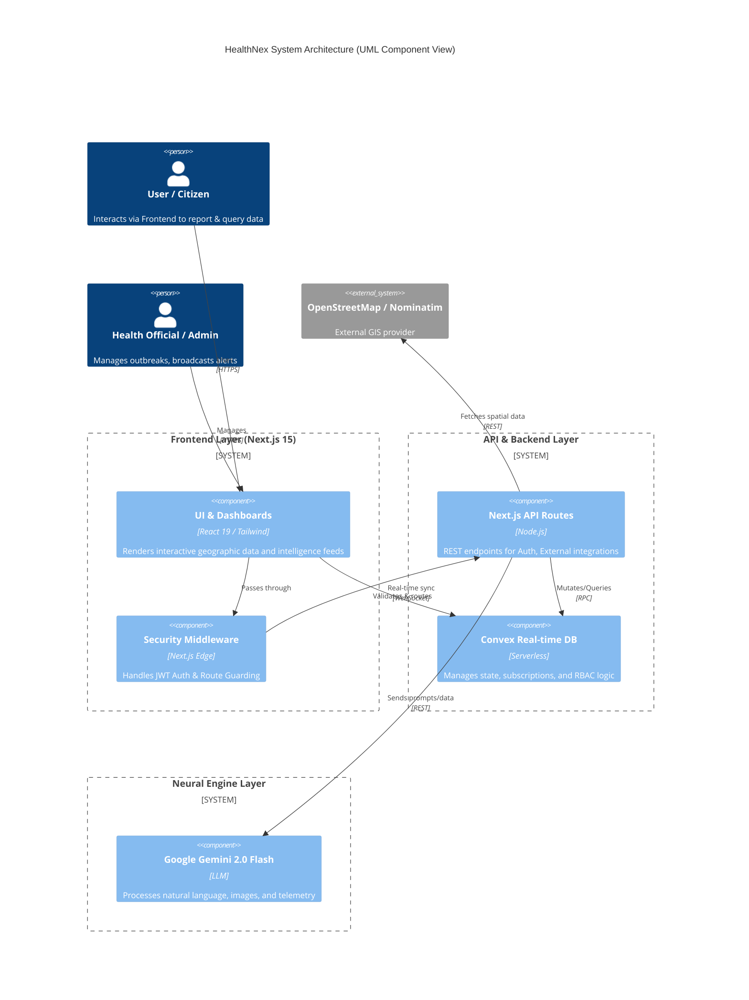
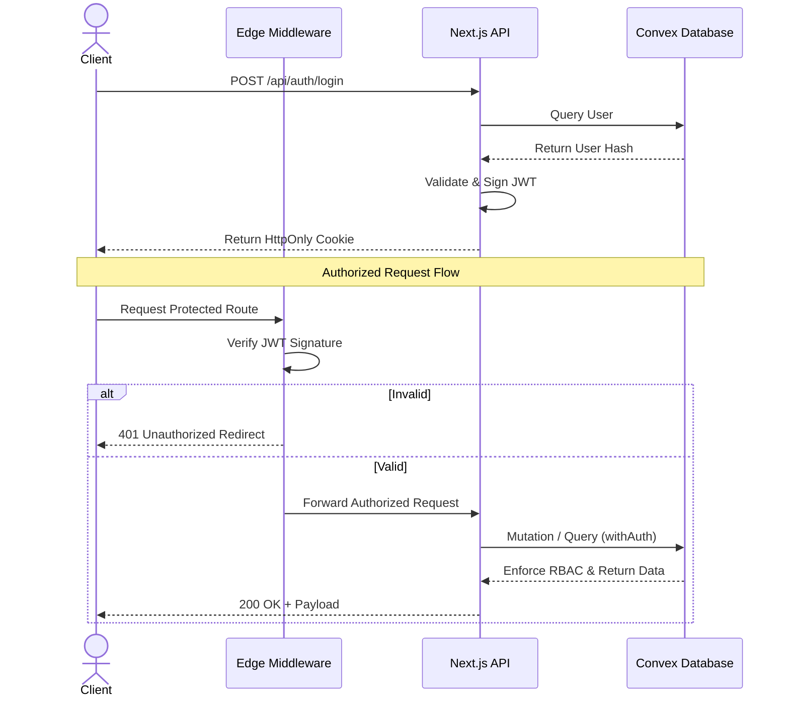
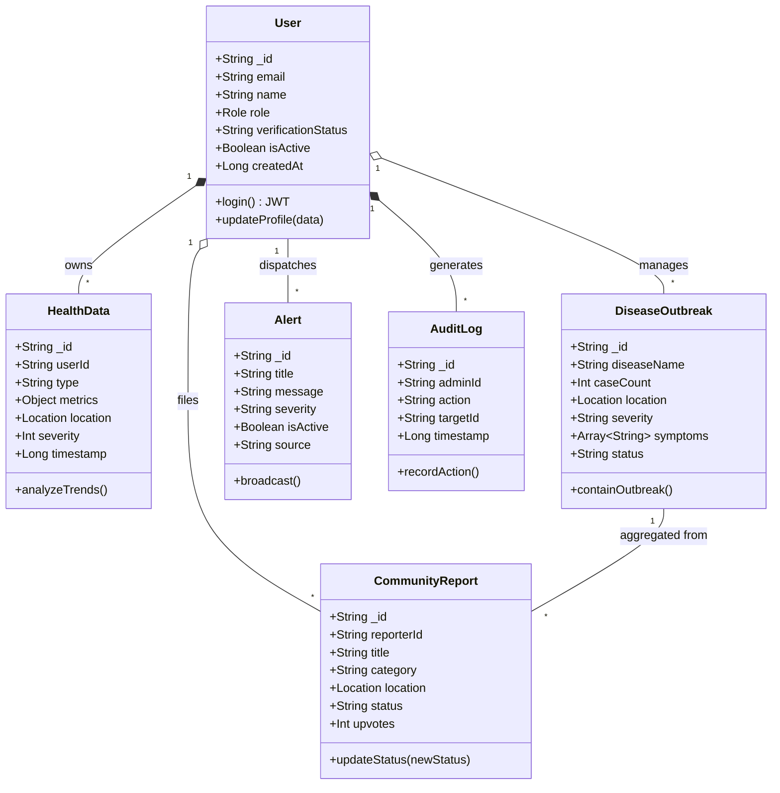
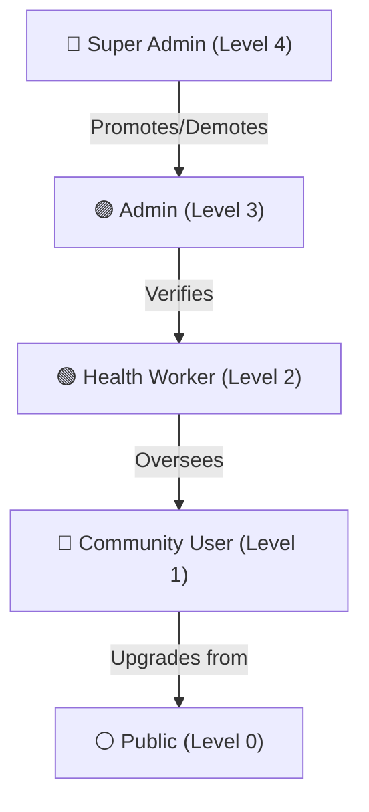
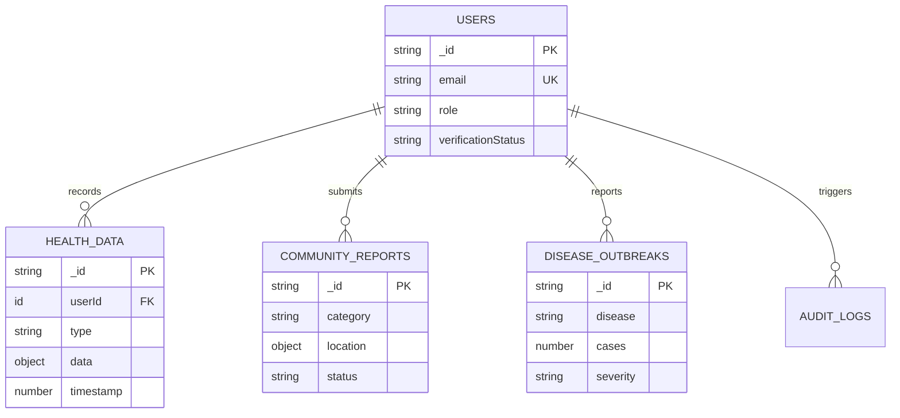

<div align="center">

# 🌐 HealthNex Intelligence Protocol

**Unified Global Health Surveillance and Proactive Response Layer**

[](https://nextjs.org/)
[](https://react.dev/)
[](https://convex.dev/)
[](https://www.typescriptlang.org/)
[](https://tailwindcss.com/)
[](https://deepmind.google/technologies/gemini/)

HealthNex is an enterprise-grade intelligence protocol designed to standardize the world's health response. Through decentralized reporting, neural forecasting, and zero-trust data synchronization, HealthNex bridges the gap between ground-level community intelligence and institutional medical response using advanced Artificial Intelligence.

[Getting Started](#getting-started) • [Architecture](#system-architecture) • [AI Engine](#neural-engine--ai) • [Security](#security--compliance) • [API Docs](#api-reference)

</div>

---

## 📑 Table of Contents

1. [System Architecture](#system-architecture)
2. [UML Class Diagram](#uml-class-diagram)
3. [Tech Stack](#tech-stack)
4. [Getting Started](#getting-started)
5. [Core Modules](#core-modules)
6. [Role-Based Access Control (RBAC)](#role-based-access-control-rbac)
7. [Neural Engine & AI](#neural-engine--ai)
8. [Database Schema (ERD)](#database-schema-erd)
9. [API Reference](#api-reference)
10. [Security & Compliance](#security--compliance)
11. [Project Structure](#project-structure)
12. [Contributing](#contributing)

---

## 🏗 System Architecture

HealthNex operates as a distributed intelligence network, employing a **zero-trust architecture** with end-to-end authentication at every layer. Below is the UML Component representation of the system topology.



### Authentication & Authorization (Sequence Diagram)



---

## 🗂 UML Class Diagram

The system's domain model relies on strict typing and relational structures managed within our NoSQL real-time engine.



---

## 🛠 Tech Stack

| Domain | Technology | Implementation Details |
|--------|-----------|------------------------|
| **Core Framework** | Next.js 15 (App Router) | Server-Side Rendering (SSR), Edge Middleware, API Routes |
| **Frontend UI** | React 19, Tailwind CSS 4 | Shadcn UI, Framer Motion 12, Radix Primitives |
| **Backend & DB** | Convex 1.27 | Real-time WebSockets, ACID-compliant mutations, Edge caching |
| **AI / Machine Learning** | Google Gemini 2.0 Flash | Multimodal prompting (OCR, Text, Prediction), Contextual AI |
| **Security** | JWT (HS256) | Zero-trust Edge auth, HttpOnly Cookies, CSRF mitigation |
| **Language & Tooling** | TypeScript 5 | Strict type-checking, Zod validation schemas |

---

## 🚀 Getting Started

### Prerequisites

- Node.js (v18.17+)
- npm, yarn, or pnpm
- A [Convex](https://convex.dev/) account
- A [Google Gemini API Key](https://aistudio.google.com/)

### Installation & Setup

1. **Clone the repository**
   ```bash
   git clone https://github.com/your-org/HealthNex.git
   cd HealthNex
   ```

2. **Install dependencies**
   ```bash
   npm install
   ```

3. **Environment Configuration**
   Copy the example environment file and populate it with your credentials:
   ```bash
   cp .env.example .env.local
   ```
   *Required variables (`.env.local`):*
   ```env
   # Backend Secrets
   JWT_SECRET=your_32_char_cryptographic_secret
   GOOGLE_AI_API_KEY=your_gemini_api_key
   CONVEX_DEPLOYMENT=your_convex_deployment_id
   
   # Frontend Variables
   NEXT_PUBLIC_CONVEX_URL=your_convex_url
   NEXT_PUBLIC_APP_URL=http://localhost:3000
   ```

4. **Initialize Backend (Convex)**
   ```bash
   npm run convex:dev
   ```

5. **Start Frontend Server**
   ```bash
   npm run dev
   ```
   *The application will be available at `http://localhost:3000`.*

---

## 🧩 Core Modules

### 1. Global Intelligence Dashboard
The command center for regional health visibility. Integrates Convex subscriptions to stream real-time metrics for:
- Active disease cases & environmental anomalies.
- Geospatial heatmap overlays (`Leaflet` integration).
- Distribution analysis categorized by vector types (Waterborne, Respiratory, etc.).

### 2. Decentralized Community Intelligence
Turns citizens into ground-level sensor nodes.
- **Reporting:** Submit real-time geo-tagged reports (Water Quality, Safety, Health).
- **Validation:** Community upvoting mechanism combined with AI-based anomaly detection filters out noise.
- **Resolution:** Health officials track and resolve issues via an immutable audit trail.

### 3. Rapid Broadcast Center
Multi-channel alerting system for institutional broadcasting.
- Support for dynamic radiuses (geo-fencing).
- Severity-indexed push alerts (Low, Medium, High, Critical).

### 4. Water & Environmental Surveillance
- API integrations with GIS data for dynamic water quality assessment.
- AI-driven risk scoring based on localized environmental telemetry (pH, turbidity, bacterial count).

---

## 🔐 Role-Based Access Control (RBAC)

HealthNex utilizes a strict, hierarchical access control model managed natively via Convex mutations and Next.js Edge Middleware.



| Privilege | Public | Community | Health Worker | Admin | Super Admin |
|-----------|:---:|:---:|:---:|:---:|:---:|
| View Public Dashboard | ✅ | ✅ | ✅ | ✅ | ✅ |
| Submit Reports | ❌ | ✅ | ✅ | ✅ | ✅ |
| Access AI Assistant | ❌ | ❌ | ✅ | ✅ | ✅ |
| Broadcast Alerts | ❌ | ❌ | ✅ | ✅ | ✅ |
| Role Management | ❌ | ❌ | ❌ | ✅ | ✅ |
| System Audit Logs | ❌ | ❌ | ❌ | ✅ | ✅ |

---

## 🧠 Neural Engine & AI

HealthNex embeds Google Gemini 2.0 Flash to power contextual health intelligence.

1. **Multilingual NLP Agent:** Real-time conversational interface supporting English, Hindi, and Bengali (including Web Speech API integration).
2. **Symptom Telemetry Analysis:** Groups localized community reports to predict imminent outbreak clusters.
3. **OCR Processing:** Users can upload medical documents/prescriptions. The Vision LLM extracts structured medical data seamlessly (limited to 10MB; JPEG/PNG/WebP).
4. **Prompt Security:** All AI pipelines utilize robust injection-protection system prompts and sanitize inputs of executable payloads.

---

## 🗄 Database Schema (ERD)

HealthNex maintains a highly normalized NoSQL structure in Convex for optimized real-time syncing.



---

## 📡 API Reference

Below is a snapshot of our REST API routes (Next.js Route Handlers). *For Convex internal RPC functions, refer to `convex/schema.ts`.*

| Endpoint | Method | Auth Level | Description |
|----------|--------|------------|-------------|
| `/api/auth/login` | `POST` | Public | Authenticates credentials, sets HttpOnly JWT |
| `/api/auth/me` | `GET` | Protected | Retrieves current session user |
| `/api/ai/analyze-symptoms` | `POST` | Protected | Passes symptom arrays to Neural Engine |
| `/api/ai/process-report` | `POST` | Protected | OCR Vision extraction of medical files |
| `/api/predict` | `POST` | Protected | Generates predictive localized health trends |
| `/api/water-quality` | `POST` | Protected | AI-aggregated water analysis by coordinates |

---

## 🛡 Security & Compliance

HealthNex is built with stringent infosec paradigms to protect sensitive medical and locational telemetry:

- **Zero-Trust Token Lifecycle:** Auth relies exclusively on HS256-signed JWTs housed inside `SameSite=Lax`, `Secure`, `HttpOnly` cookies. No client-side storage (localStorage/sessionStorage) is permitted for session tokens.
- **CSRF Mitigation:** Strict Origin & Referer header validation on all state-mutating API routes.
- **Input Hardening:** End-to-end Zod schemas validate both client requests and Convex mutations. AI prompts strip syntax-breaking characters (`<`, `>`, `{`, `}`).
- **Immutable Auditing:** All Level 3/Level 4 actions (role changes, system overrides) are written to an append-only `AuditLogs` table.

---

## 📂 Project Structure

```text
HealthNex/
├── convex/                   # Backend: Real-time DB & Serverless Logic
│   ├── schema.ts             # Strict schema definitions
│   ├── users.ts              # RBAC & User mutations
│   └── ... 
├── src/
│   ├── app/                  # Next.js App Router (Pages & API)
│   │   ├── api/              # REST Endpoints (Auth, AI, External integrations)
│   │   ├── dashboard/        # Intelligence Dashboard UI
│   │   └── ...
│   ├── components/           # React Components
│   │   ├── ui/               # Shadcn UI primitives
│   │   └── dashboard/        # Complex data visualizations
│   ├── lib/                  # Utilities (JWT, Zod, AI wrappers)
│   └── middleware.ts         # Edge Security & Route Guarding
├── public/                   # Static Assets
└── tailwind.config.ts        # Design System Tokens
```

---

## 🤝 Contributing

We welcome contributions from the open-source community, epidemiologists, and security researchers.

1. Fork the repository.
2. Create a feature branch (`git checkout -b feature/amazing-feature`).
3. Commit your changes (`git commit -m 'feat: Add amazing feature'`).
4. Push to the branch (`git push origin feature/amazing-feature`).
5. Open a Pull Request.

Please ensure all tests pass (`npm run test`) and code complies with our formatting standards (`npm run lint`).

---

<div align="center">
  <p>Built for the Future of Global Health Security. <br/> <b>HealthNex</b> — Empowering Communities, Equipping Institutions.</p>
</div>
