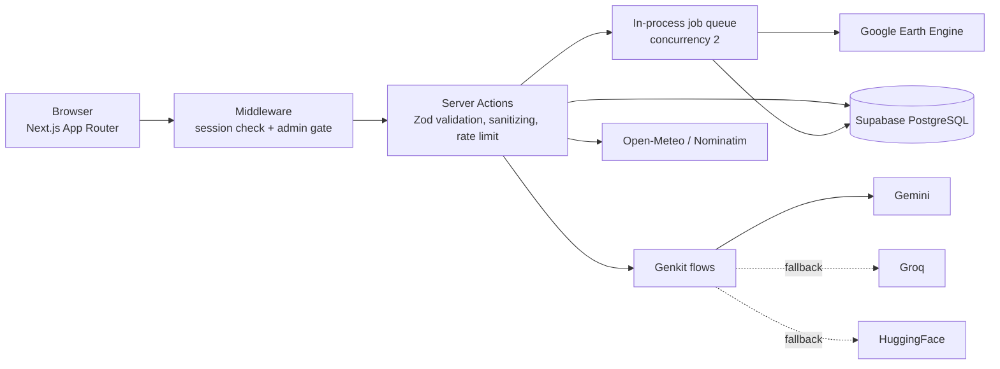
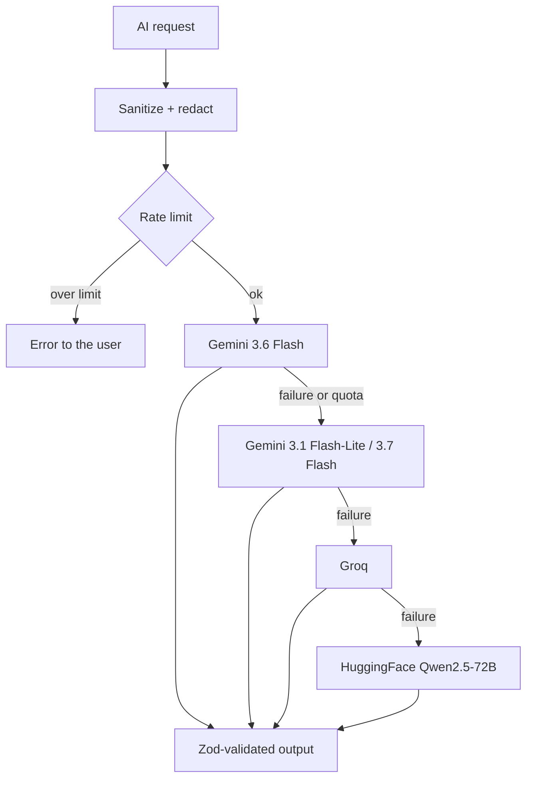

<div align="center">

# Earth Insights

### Satellite analytics and AI crop advice, powered by Google Earth Engine

_Pick a place on Earth, see how it changed, and get advice you can act on._

[](LICENSE)
[](https://github.com/ArrinPaul/LandSat/actions/workflows/ci.yml)


[Quickstart](#quickstart) · [Features](#features) · [How it works](#how-the-analysis-works) · [AI engine](#ai-engine) · [Security](#security) · [Project status](#project-status) · [Report an issue](https://github.com/ArrinPaul/LandSat/issues)

</div>

---

## About

Earth Insights is a web app that turns satellite imagery into answers. You choose a location, either by coordinates, by name or by drawing an area on a map. It pulls Sentinel-2, Landsat 8/9 or MODIS imagery through Google Earth Engine and computes vegetation, water, built-up and burn indices over time. It also compares land cover before and after, and explains the change in plain language with Gemini.

Beyond imagery, it adds weather from Open-Meteo and AI-assisted tools for farmers and analysts: crop suggestions, irrigation scheduling, soil-moisture and yield estimates, drought and flood risk, and a spoken advisory. The interface is available in 13 languages.

**Who it's for:** researchers and students exploring land-cover change, agronomists and farmers planning crops, and anyone who wants satellite data without writing Earth Engine code.

> This is an independent project. It uses publicly available Landsat, Sentinel-2 and MODIS data through Google Earth Engine, and is not affiliated with or endorsed by NASA, USGS, ESA or Google.

## Table of Contents

1. [About](#about)
2. [Features](#features)
3. [How the analysis works](#how-the-analysis-works)
4. [Architecture](#architecture)
5. [Tech stack](#tech-stack)
6. [Quickstart](#quickstart)
7. [Configuration](#configuration)
8. [AI engine](#ai-engine)
9. [Authentication and roles](#authentication-and-roles)
10. [Database](#database)
11. [Server actions](#server-actions)
12. [Security](#security)
13. [Testing](#testing)
14. [Scripts](#scripts)
15. [Project structure](#project-structure)
16. [Deployment](#deployment)
17. [Project status](#project-status)
18. [Troubleshooting](#troubleshooting)
19. [Contributing](#contributing)
20. [License](#license)

## Features

| Area | What it does |
| :--- | :--- |
| **Satellite analytics** | Time series of NDVI, NDWI, NDBI and NBR for any point or drawn polygon, with a selectable source (Sentinel-2, Landsat 8/9 or MODIS), date range and radius (10 to 2000 m). True-colour thumbnails and a timelapse. |
| **Land-cover change** | Area of vegetation, water, built-up and other surfaces at the start and end of the period, with absolute and percentage change and before/after maps. |
| **AI change insights** | Gemini explains what changed and why it may have happened, and writes a report summary. |
| **Ground-truth comparison** | Upload your own `date,value` CSV and compare it with the satellite series in a scatter plot. Export the computed metrics as CSV. An example is in `test_ground_truth.csv`. |
| **Predict suite** | Weather forecast, crop planning, irrigation schedule, soil moisture, crop yield, drought and flood risk, scenario analysis and satellite pass prediction. |
| **Crop advisor** | Crop suggestions and detailed advice on planting density, pests and fertilization, with text-to-speech playback. |
| **AI assistant** | A floating chatbot grounded in agriculture and satellite topics. |
| **Accounts** | Registration, login, onboarding that captures farm details, profile and password management, and saved history and preferences. |
| **Admin area** | User management, activity log, analysis log and usage analytics for administrators. |
| **13 languages** | Assamese, Bengali, English, Gujarati, Hindi, Kannada, Malayalam, Marathi, Odia, Punjabi, Spanish, Tamil and Telugu, with light and dark themes. |

## How the analysis works

**Imagery sources** (selected per request):

| Source | Earth Engine collection | Resolution |
| :--- | :--- | :--- |
| `sentinel2` | `COPERNICUS/S2_SR_HARMONIZED` | 10 m |
| `landsat` | `LANDSAT/LC09/C02/T1_L2` merged with `LC08` | 30 m |
| `modis` | `MODIS/061/MOD09GA` | 500 m |

Scenes with 75% or more cloud cover are filtered out for Sentinel-2 and Landsat. For a drawn polygon the indices are averaged over the whole shape. For a point, a circle of the chosen radius is used.

**Spectral indices** are normalized differences of two bands, $(A - B)/(A + B)$:

| Index | Measures | Sentinel-2 bands |
| :--- | :--- | :--- |
| NDVI | Vegetation vigour | NIR `B8`, red `B4` |
| NDWI | Surface water | green `B3`, NIR `B8` |
| NDBI | Built-up surfaces | SWIR `B11`, NIR `B8` |
| NBR | Burn severity | NIR `B8A`, SWIR `B12` |

Landsat and MODIS use the equivalent bands for their sensors.

**Land-cover classification** is a transparent rule-based classifier on those indices, applied per pixel:

1. **Water** if NDWI > 0.
2. Otherwise **vegetation** if NDVI > 0.2.
3. Otherwise **built-up** if NDBI > 0.
4. Everything else is **other**.

The result is compared between the first and last image of the period. The reported confidence is the cloud-free fraction of the imagery, which is a data-quality signal and not a model score. There is no trained neural network in the live pipeline.

Gemini does not compute any numbers. It only writes explanations of the numbers the pipeline produces.

## Architecture


```mermaid
flowchart LR
    U[Browser<br/>Next.js App Router] --> MW[Middleware<br/>session check + admin gate]
    MW --> SA[Server Actions<br/>Zod validation, sanitizing, rate limit]
    SA --> Q[In-process job queue<br/>concurrency 2]
    Q --> GEE[Google Earth Engine]
    SA --> AI[Genkit flows]
    AI --> G[Gemini]
    AI -.->|fallback| GR[Groq]
    AI -.->|fallback| HF[HuggingFace]
    SA --> OM[Open-Meteo / Nominatim]
    SA --> DB[(Supabase PostgreSQL)]
    Q --> DB
```

- **Server Actions** in `src/lib/actions.ts` are the main API. Every action goes through one wrapper that sanitizes input, applies rate limiting, retries with backoff, redacts errors and normalizes confidence values to 0 to 1.
- **Earth Engine jobs** are started and then polled by job ID, so the UI never blocks. Results are stored in the `analysis_jobs` table, with an in-memory fallback when Supabase is unavailable.
- **Genkit flows** in `src/ai/flows/` wrap each AI feature with a Zod-typed input and output.

## Tech stack

| Layer | Technology |
| :--- | :--- |
| Framework | Next.js 15 (App Router, Turbopack, Server Actions), React 18, TypeScript 5 |
| UI | Tailwind CSS 3, Radix UI, Recharts, Leaflet with leaflet-draw |
| AI | Google Genkit 1.21, Gemini, Groq SDK, HuggingFace Inference |
| Earth observation | `@google/earthengine`, Open-Meteo, Nominatim (OpenStreetMap) |
| Data and auth | Supabase PostgreSQL, `bcryptjs`, `jose` (signed session cookie) |
| Validation | Zod |
| Quality | Vitest, Playwright, ESLint, Prettier, Husky |
| Hosting | Firebase App Hosting (`apphosting.yaml`) |

## Quickstart

Prerequisites:

- **Node.js 24.11.1 or newer 24.x** (`engines` allows `>=24.11.1 <25`, and `.nvmrc` pins `24.11.1`)
- A [Supabase](https://supabase.com) project, which is required
- A Gemini API key from [Google AI Studio](https://aistudio.google.com/)
- A Google Earth Engine service account, if you want satellite analysis

```bash
git clone https://github.com/ArrinPaul/LandSat.git
cd LandSat
npm install

cp .env.example .env.local
# fill in JWT_SECRET, the Supabase variables, and at least one AI key
```

Create the database tables by running every file in `supabase/migrations/` in order (`0001` to `0006`) in the Supabase SQL editor. Then start the app:

```bash
npm run dev
```

Open <http://localhost:9003>, register an account and follow the onboarding.

**Create the first admin.** New accounts get the `viewer` role. Promote yourself once in the Supabase SQL editor, and after that admins can change roles from `/admin/users`:

```sql
update users set role = 'admin' where email = 'you@example.com';
```

## Configuration

Copy `.env.example` to `.env.local`. Never commit it.

| Variable | Required | Purpose |
| :--- | :---: | :--- |
| `JWT_SECRET` | Yes | Random string of at least 32 characters used to sign session cookies |
| `NEXT_PUBLIC_SUPABASE_URL`, `NEXT_PUBLIC_SUPABASE_ANON_KEY` | Yes | Supabase project |
| `SUPABASE_SERVICE_ROLE_KEY` | Yes | Server-side database access. It bypasses RLS, so keep it secret. |
| `GEMINI_API_KEY` | One AI key | Primary AI provider. `GOOGLE_GENAI_API_KEY` is an accepted alias. |
| `GROQ_API_KEY`, `HUGGINGFACE_API_KEY` | No | Fallback AI providers |
| `GOOGLE_APPLICATION_CREDENTIALS_JSON` | For satellite analysis | Service-account key as a single-line JSON string. Without it, Earth Engine analysis fails. |
| `AUTH_REQUIRED` | No | Set `true` to make server actions reject callers without a session instead of treating them as anonymous viewers |
| `JOB_QUEUE_CONCURRENCY` | No | Concurrent Earth Engine jobs per server instance (default `2`) |
| `NODE_ENV` | No | `development` by default |

## AI engine

AI calls go through Genkit and a fallback chain, so a quota error on one provider does not stop the feature.


```mermaid
flowchart TD
    R[AI request] --> S[Sanitize + redact]
    S --> RL{Rate limit}
    RL -->|over limit| E[Error to the user]
    RL -->|ok| P[Gemini 3.6 Flash]
    P -->|failure or quota| F1[Gemini 3.1 Flash-Lite / 3.7 Flash]
    F1 -->|failure| GQ[Groq]
    GQ -->|failure| HF[HuggingFace Qwen2.5-72B]
    P --> O[Zod-validated output]
    F1 --> O
    GQ --> O
    HF --> O
```

Models are set in `src/ai/genkit.ts` (Gemini) and `src/ai/providers.ts` (Groq tries `openai/gpt-oss-120b`, `openai/gpt-oss-20b`, then `groq/compound`; HuggingFace uses `Qwen/Qwen2.5-72B-Instruct`). Model names change often, so check those files for the current values.

Flows (`src/ai/flows/`): `compute-metrics`, `analyze-change`, `generate-insights`, `generate-report-summary`, `generate-timelapse-video`, `suggest-crop`, `get-advanced-crop-advice`, `plan-crops`, `schedule-irrigation`, `predict-soil-moisture`, `predict-crop-yield`, `analyze-drought-flood-risk`, `predict-satellite-pass`, `get-weather-report`, `suggest-coordinates`, `chatbot` and `text-to-speech`. Tools (`src/ai/tools/`) cover soil type, soil moisture, historical baseline, drought and flood data, and scenario analysis.

Several predictions (soil moisture, yield, risk) are AI-generated estimates built on weather and location data. Treat them as decision support and not as measurements.

## Authentication and roles

Accounts are stored in the `users` table with `bcrypt` password hashes. Login sets a signed 7-day session cookie (`jose`, JWT). The Edge middleware requires a session for `/dashboard`, `/predict`, `/crop-advisor`, `/settings`, `/onboarding` and `/admin`, redirects signed-in users away from `/login` and `/register`, and strips any client-supplied identity headers.

Roles are `viewer` (the default), `analyst` and `admin`. **Only `admin` is enforced today:** the `/admin` pages and `/api/admin/*` routes require it. All signed-in users can use the satellite, predict and crop-advisor features regardless of role, so `analyst` currently behaves like `viewer`. See [Project status](#project-status).

## Database

Supabase PostgreSQL, set up by `supabase/migrations/0001` to `0006`. All server access uses the service-role key, which bypasses Row Level Security by design, so RLS is enabled but acts as a backstop.

| Table | Purpose |
| :--- | :--- |
| `users` | Accounts, role, onboarding progress, disabled flag, last login |
| `profiles` | Farm details from onboarding (location, soil type, planting season, machinery access) |
| `account_events` | Audit trail for account actions |
| `user_preferences` | Language, theme and other preferences |
| `user_history` | Dashboard and chat history |
| `analysis_jobs` | Earth Engine job status, input and result |
| `system_metrics` | Usage metrics shown in admin analytics |

## Server actions

The app's API is a set of Next.js Server Actions in `src/lib/actions.ts`, validated by Zod schemas in `src/lib/action-schemas.ts`. Each returns `{ data, error }`.

| Action | Purpose |
| :--- | :--- |
| `startMetricsComputationAction`, `getMetricsResultAction` | Start an Earth Engine job and poll for its result |
| `suggestCoordinatesAction`, `geocodeCityAction` | Turn a place name into coordinates |
| `generateInsightAction`, `generateReportAction` | AI insights and report summary |
| `getWeatherReportAction`, `predictSatellitePassAction` | Weather and satellite passes |
| `planCropsAction`, `suggestCropAction`, `getAdvancedCropAdviceAction` | Crop planning and advice |
| `scheduleIrrigationAction`, `predictSoilMoistureAction`, `predictCropYieldAction` | Irrigation, soil moisture and yield |
| `analyzeDroughtAndFloodRiskAction`, `runScenarioAnalysisAction` | Hazard risk and what-if analysis |
| `generateTimelapseVideoAction`, `textToSpeechAction`, `chatbotAction` | Timelapse, speech and chat |
| `saveUserPreferencesAction`, `getUserPreferencesAction`, `appendUserHistoryAction`, `listUserHistoryAction` | Preferences and history |

Auth, profile and admin features use conventional route handlers under `src/app/api/` (`auth/*`, `profile/*`, `onboarding`, `admin/*`).

## Security

- **Session cookies** are signed JWTs with a 7-day lifetime. The app refuses to sign or verify without `JWT_SECRET`.
- **Passwords** are hashed with bcrypt (10 rounds) and must be at least 8 characters.
- **Route protection.** Middleware guards the app pages and the admin area.
- **Prompt sanitizing.** Input is stripped of prompt-delimiter tags and common jailbreak phrases and capped at 4000 characters before it reaches an AI model.
- **Secret redaction.** Error messages and logs have bearer tokens, API keys and long token-like strings removed.
- **Validation.** Server actions parse their input with Zod, including coordinate ranges.
- **Rate limiting.** Each user, IP and action is limited to 15 requests per minute. The limiter is in memory, so it is per server instance and resets on restart.
- **Supply chain.** CI runs `npm audit` and fails on high-severity findings.

## Testing

```bash
npm test               # Vitest: 4 files, 21 tests
npm run test:contracts # server action schema contract tests only
npm run test:e2e       # Playwright
npm run typecheck && npm run lint
```

Vitest covers server-action contracts, change analysis, CSV parsing and JWT handling. Playwright (`e2e/dashboard.spec.ts`) checks that anonymous visitors are redirected to `/login` for the protected pages. Earth Engine, Gemini and Supabase are not exercised by the automated tests, so those integrations need manual checks with real credentials.

CI (`.github/workflows/ci.yml`) runs lint, typecheck, tests, contract tests, a high-severity audit and a production build on every push and pull request to `main`. A Husky pre-commit hook is also configured.

## Scripts

| Command | What it does |
| :--- | :--- |
| `npm run dev` | Dev server on port 9003 with Turbopack |
| `npm run build` / `npm start` | Production build and server |
| `npm run genkit:dev` | Genkit Developer UI for the AI flows |
| `npm run typecheck`, `npm run lint` | Type check and ESLint (zero warnings allowed) |
| `npm test`, `npm run test:contracts`, `npm run test:e2e` | Test suites |
| `npm run security:audit` | `npm audit` at high severity |
| `npm run format`, `npm run format:check` | Prettier |

## Project structure

```text
LandSat/
├── src/
│   ├── app/            Pages: landing, dashboard, login, register, onboarding, settings,
│   │                   admin/*; route handlers in api/ (auth, profile, onboarding, admin)
│   ├── ai/             Genkit flows, tools, provider fallback, rate limiter, prompt governance
│   ├── components/     Dashboard, GIS map, charts, chatbot, forms, ui/ primitives
│   ├── lib/            Server actions, schemas, auth, JWT, security, Supabase, job queue
│   ├── services/       Open-Meteo and Nominatim adapters
│   ├── locales/        13 translation catalogs
│   └── test/           Vitest suites
├── supabase/migrations/  SQL schema (0001 to 0006)
├── e2e/                  Playwright tests
├── infra/gcp/            GCP definitions (Cloud Run jobs, workflow, Pub/Sub, alerts, budget)
├── artifacts/ml-phase2/  Records from a land-cover model experiment (not used at runtime)
├── docs/superpowers/     Frontend rework design spec and plan
├── apphosting.yaml       Firebase App Hosting config
└── test_ground_truth.csv Example ground-truth CSV
```

## Deployment

The app is configured for Firebase App Hosting (`apphosting.yaml`, `.firebaserc`, up to 5 instances). Set the variables from [Configuration](#configuration) as secrets, apply the Supabase migrations and deploy. Because the rate limiter and job queue live in process memory, each instance has its own limits and queue.

`infra/gcp/` holds definitions for a larger batch pipeline (preprocess, train and inference Cloud Run jobs, a workflow, Pub/Sub topics, alerts and a budget). They are infrastructure definitions only, and the app does not call them today.

## Project status

The app builds, type-checks, lints cleanly and passes its 21 unit and contract tests. Known gaps:

- **Roles beyond `admin` are not enforced.** The permissions matrix in older versions of this README (analyst-only satellite computation and so on) was not implemented. All signed-in users can use every feature.
- **The admin settings page is a mock.** Saving shows a toast but persists nothing.
- **No neural-network segmentation.** Land cover uses fixed index thresholds. `artifacts/ml-phase2/` records a U-Net experiment (mIoU 0.889 on its own validation set) that the running app does not use.
- **No R² or regression line** in the ground-truth comparison. It is a scatter plot only.
- **In-memory rate limiting and job queue** do not coordinate across instances.
- **Unverified integrations.** Earth Engine, Gemini, Groq, HuggingFace and Supabase calls are not covered by automated tests.

## Troubleshooting

| Symptom | Likely cause | Fix |
| :--- | :--- | :--- |
| Every sign-in or session check fails | `JWT_SECRET` is missing or shorter than 32 characters | Set a long random `JWT_SECRET` and restart. |
| Database errors, or registration fails | Supabase variables are empty or migrations were not run | Set the three Supabase variables and run `supabase/migrations/0001` to `0006` in order. |
| "All AI and Satellite services are disabled" | No AI key and no Earth Engine credentials are set | Set `GEMINI_API_KEY` (or another AI key) and/or `GOOGLE_APPLICATION_CREDENTIALS_JSON`. |
| "GOOGLE_APPLICATION_CREDENTIALS_JSON environment variable not set" | Satellite analysis needs a service-account key | Add the service-account JSON as a single line. |
| "No valid satellite imagery found" | No scenes for that place, dates and cloud limit | Widen the date range, increase the radius or try another source. |
| "Too Many Requests" | More than 15 calls per minute to one action | Wait a minute. The limit is per user, IP and action. |
| Redirected from `/admin` to `/dashboard` | Your account is not an admin | Set `role = 'admin'` for your user in the `users` table. |
| Node version error on install or start | Node outside `>=24.11.1 <25` | Use `nvm use` with the pinned `.nvmrc`. |
| Lint fails in CI on a warning | ESLint runs with `--max-warnings=0` | Fix the warning, or run `npm run lint:fix`. |

## Contributing

Issues and pull requests are welcome. Run `npm run lint`, `npm run typecheck`, `npm test` and `npm run build` before opening a PR, which are the same checks CI runs. Never commit `.env` files, service-account keys or API keys.

## License

Released under the MIT License. See [LICENSE](LICENSE).
